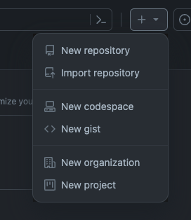
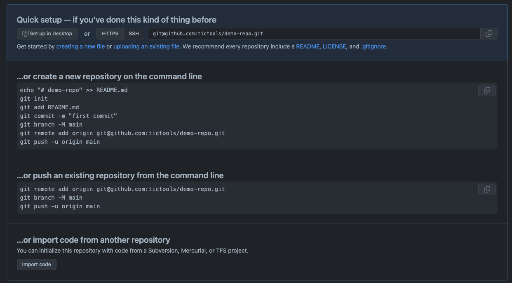

# DEVELOPMENT WORKFLOW: git & GitHub

## GIT


Git is a free and open source distributed version control system designed to handle everything from small to very large projects with speed and efficiency.

### Main CLI commands

#### init

```bash
## Create an empty Git repository
git init
```

#### pull

```bash
## Fetch data from current remote branch and integrate changes with local branch

git pull
```

```bash
## Fetch data from specified remote branch and integrate changes with local branch

git pull origin <branch>

## This command is a shorcut to merge directly changes
## from base branch into current develpment branch
## Following command sequence executes the same action

git checkout <base branch>
git pull
git checkout <current development branch>
git merge <base branch>
```

#### ckeckout

```bash
## Switch to existing branch
git ckeckout <branch name>

## Create a new local branch and switch to it
git checkout -b <branch name>
```

#### add

```bash
## Add file contents to the index

git add <filename> ## add only selected file

git add <folder> ## add all changes contained in selected directory

git add --all ## add all changes

```

#### commit

```bash
## Record changes to the repository
git commit -m "<message>"
```

#### push

```bash
## Update remote repository along with local development branch
git push
```

#### clone

```bash
## Clone a repository into a new local directory
git clone
```

## GitHub


GitHub is a platform to build, scale, and deliver secure software. This cloud-based service will help developers:

- store and manage their code
- track and control changes to their code.
- work together with other developers on projects from anywhere

### Workflow

#### Create local repository

A repository (AKA _repo_) is used to organize a single project. Repositories can contain anything your project needs (folders and files, images, videos,...).

1. Create a directory in your computer to store all the resources you will develop for your project.
2. Take care of name. It should be aligned with the name of your project. Naming matters...
3. Open your IDE and start your development.

```bash
## HINT: You can directly create project directory from terminal

## 1. Move to folder wher project will be stored
## 2. Create the directory and move into it
mkdir <project name>
cd <project name>

```

#### Create remote repository [ [↗] ](https://docs.github.com/en/get-started/quickstart/hello-world#creating-a-repository)

You can create a new remote repo in GitHub using sthe **'New repository'** action.


#### Link remote and local repository

After creating remote repository in GitHub, you can execute step by step in your terminal commands described in section **create a new repository on the commnad line**.



```bash
echo "# demo-repo" >> README.md ## skip if README is created. You can create it later
git init
git add README.md ## skip if README is not still created
git commit -m "first commit"
git branch -M main ## skip if current branch is already named as 'main'
git remote add origin git@github.com:<your-github-user>/<repo-name>.git
git push -u origin main
```

## Creating a branch [ [↗] ](https://docs.github.com/en/get-started/quickstart/hello-world#creating-a-branch)

Branching lets you have different versions of a repository at one time.

By default, your repository has one branch named `main` that is considered to be the definitive branch. You can create additional branches off of main in your repository.

This diagram shows:

- The `main` branch
- A new branch called `feature`
- The journey that feature takes before it's merged into main


---

## Source

### GIT

- official doc: https://git-scm.com/

### GitHub

- official doc: https://git-scm.com/
